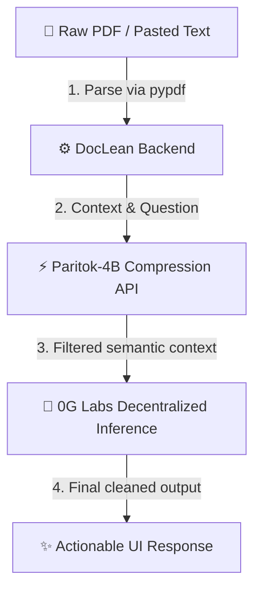

# DocLean - Token-Efficient Context-Compressed AI Document Reviewer

[](https://github.com/Paritok-official/paritok-4b-v1)

DocLean is an AI-powered document review system designed to make large-scale document analysis economically viable. By leveraging **Paritok's Context Compression Model** alongside **0G Labs' Decentralized Compute Network**, DocLean dynamically filters out redundant details *before* sending requests for inference, slashing costs and latency while preserving full answer quality.

---

## 💡 The Core Story: Why Paritok?

Modern AI agents and RAG systems have a massive bottleneck: **context bloat**. Large documents—such as pitch decks, financial reports, academic papers, and contracts—contain thousands of tokens. Sending the entire document to an LLM for every question is slow, resource-heavy, and expensive.

**DocLean solves this by using Paritok as an intelligent pre-processing context compression layer.**

| Scenario | ❌ Without Paritok |  With Paritok |
| :--- | :--- | :--- |
| **Data Payload** | Sends the entire raw document to the LLM | Sends **only** the context relevant to the user's question |
| **Inference Cost** | High token consumption and high API bills | **90%+ fewer input tokens** (slashed costs) |
| **Latency** | Slower responses (waiting for model to read fluff) | Faster, snappier responses |
| **Compute Usage** | Wastes decentralized GPU resources on noise | Maximizes efficiency on decentralized compute nodes |

---

## 🏗️ Technical Architecture & Data Pipeline

DocLean acts as the orchestrator tying together high-fidelity text extraction, local metrics analysis, cognitive context compression, and decentralized model execution:



### Key Technical Roles:
*   **Paritok (`Paritok-4B-v1`)**: The prompt shrinker. It reads the document context, identifies the specific question asked, and strips out boilerplate text, headers, and irrelevant paragraphs, reducing token size by up to 97%.
*   **0G Labs (`0GM-1.0-35B-A3B-SIA`)**: The inference engine. It runs the compressed context on its decentralized compute network to generate high-fidelity reasoning answers.
*   **DocLean**: The application layer. It parses files, manages the dynamic compression diff logs, monitors token savings, and provides the visual interface.

---

## 🎯 Target Audience (A Universal Use Case)
Unlike niche developer tools, DocLean provides value to anyone who receives a 100-page PDF and just wants answers:

*   **🎓 Students**: Review textbooks, lecture notes, and study guides efficiently.
*   **💼 Investors**: Analyze pitch decks, annual reports, and financial statements in seconds.
*   **🚀 Founders**: Speed up competitor analysis, market reports, and RFP responses.
*   **⚖️ Lawyers**: Extract clauses, terms, and conditions from long contracts.
*   **🔬 Researchers**: Query academic publications and retrieve methodology summaries.
*   **🤝 Recruiters & HR**: Review large batches of CVs, resumes, and employee handbooks.
*   **📈 Sales Teams**: Cross-reference product brochures and sales documentation.

---

## ⚡ Specifications & Fallback Protections

*   **Optimal Context Limit**: Up to **8,000 tokens** (~6,000 words) of text or PDF content.
*   **Timeout Bypass**: If Paritok compression takes longer than 20 seconds, the backend automatically catches the timeout and forwards the uncompressed document directly to 0G Compute, guaranteeing a successful response.
*   **Real-time Diff Tracker**: A dynamic algorithm in the backend compares the original document against the compressed output on every request, displaying the exact lines removed vs. preserved in the dashboard UI.

---

## 🚀 Setup & Execution Guide

### 💻 1. Backend Setup (FastAPI)
1.  Navigate to the backend directory:
    ```bash
    cd backend
    ```
2.  Create a virtual environment and activate it:
    ```bash
    python -m venv .venv
    # On Windows:
    .venv\Scripts\activate
    # On macOS/Linux:
    source .venv/bin/activate
    ```
3.  Install dependencies:
    ```bash
    pip install -r requirements.txt
    ```
4.  Create a `.env` file in the `backend/` folder:
    ```env
    PARITOK_API_KEY=pk_live_iqkn9k5Csp8IkEYkHim5trSXTGRQnrZb
    0G_API_KEY=your_0g_api_key
    0G_MODEL=0GM-1.0-35B-A3B-SIA
    0G_ENDPOINT=https://compute-network-29.integratenetwork.work/v1/proxy/chat/completions
    ```
5.  Start the backend server:
    ```bash
    python main.py
    ```

### 🎨 2. Frontend Setup (React)
1.  Navigate to the frontend directory:
    ```bash
    cd frontend
    ```
2.  Install dependencies:
    ```bash
    npm install
    ```
3.  Start the development server:
    ```bash
    npm run dev
    ```

---

## 📄 License
This project is licensed under the Apache License 2.0 - see the [LICENSE](LICENSE) file for details.
